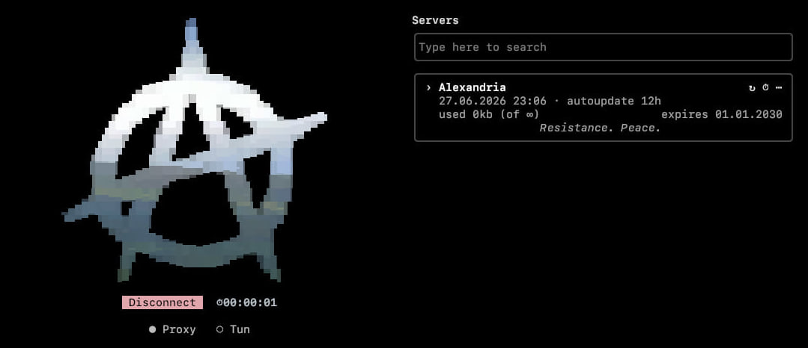

<p align="center">
  <a href="https://github.com/alexandria-proxy/alexandria-cli" target="_blank" rel="noopener noreferrer">
    
  </a>
</p>

<h1 align="center">Alexandria</h1>

<p align="center">
    <strong>A lightweight, censorship-resistant Xray-core client for your terminal</strong>
</p>

---

<p align="center">
    <a href="https://github.com/alexandria-proxy/alexandria-cli/releases"></a>
    <a href="LICENSE"></a>
    <a href="#installation-guide"></a>
    <a href="https://t.me/Alexandriavpn"></a>
    <a href="https://github.com/alexandria-proxy/alexandria-cli/stargazers"></a>
</p>

<p align="center">
  <a href="./README-fa.md">🇮🇷 فارسی</a>
  /
  <a href="./README-ru.md">🇷🇺 Русский</a>
</p>

<p align="center">
  
</p>

## Table of Contents

> **Quick Navigation** - Jump to any section below

-   [Overview](#overview)
-   [Get a server](#get-a-server)
-   [Installation guide](#installation-guide)
-   [Documentation](#documentation)

---

# Overview

> **What is Alexandria?**

Alexandria is a single-binary client for connecting through [Xray-core](https://github.com/XTLS/Xray-core). Run `alexandria-cli` and you drop into an interactive TUI. The proxy keeps running in a background daemon even after you close the panel, and reconnects when you open it again.

---

# Get a server

> **Need a subscription?**

We're an Xray **VPN provider** too. Grab a subscription from our Telegram bot and you're ready to connect:

[](https://t.me/alexandriavpnbot)

---

# Installation guide

> **Quick Start** - Get Alexandria running in seconds

### Linux / macOS

```bash
curl -fsSL https://raw.githubusercontent.com/alexandria-proxy/alexandria-cli/main/scripts/install.sh | sh
```

### Windows (PowerShell)

```powershell
irm https://raw.githubusercontent.com/alexandria-proxy/alexandria-cli/main/scripts/install.ps1 | iex
```

### Arch Linux

```bash
yay -S alexandria-cli
```

### Build from source

Needs Go 1.26+. `scripts/fetch-core.sh` fetches the vetted Xray core so the binary finds it at runtime.

```bash
git clone --depth 1 https://github.com/alexandria-proxy/alexandria-cli
cd alexandria-cli
bash scripts/fetch-core.sh
go build -o alexandria-cli .
./alexandria-cli
```

The fresh binary isn't on your `PATH` yet, so run it with `./`. For TUN mode use `sudo ./alexandria-cli`.

### After installation

<div align="left">

**The installer** pulls the prebuilt archive from [Releases](https://github.com/alexandria-proxy/alexandria-cli/releases), verifies it against `checksums.txt`, and drops `alexandria-cli` + the bundled `xray` into a PATH-wired prefix.

**Run it:**

```bash
alexandria-cli
```

> **TUN mode** needs elevated privileges. Start Alexandria with `sudo` (Linux / macOS) or from an **Administrator** terminal (Windows). Proxy mode runs fine as a normal user.

**Files are located at** `~/.config/alexandria/`

</div>

---

# Documentation

<div align="left">

**Read this guide in your language:**

🇺🇸 **[English](README.md)**

🇮🇷 **[فارسی](README-fa.md)**

🇷🇺 **[Русский](README-ru.md)**

</div>

> **Contributing:** issues and PRs are welcome on [GitHub](https://github.com/alexandria-proxy/alexandria-cli).

---

<p align="center">
  <em>Resistance. Peace.</em>
</p>
